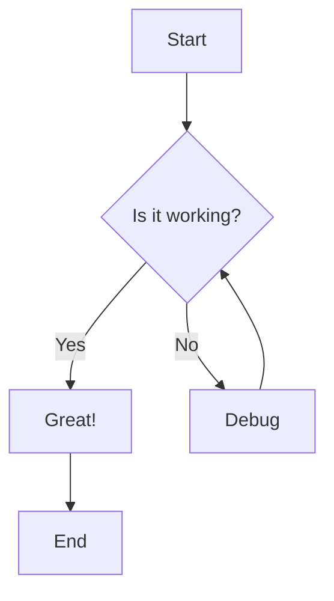

# Test Document for mdview
This document tests various markdown features supported by mdview.

## Formatted Text

Here is some **bold text**, *italic text*, and `inline code`. You can also use ~~strikethrough~~ and combine **_bold italic_** text.

> This is a blockquote that spans multiple lines.
> It demonstrates how quoted text is rendered.

## Code Block with Syntax Highlighting

```javascript
function fibonacci(n) {
  if (n <= 1) return n;
  return fibonacci(n - 1) + fibonacci(n - 2);
}

// Calculate the first 10 Fibonacci numbers
for (let i = 0; i < 10; i++) {
  console.log(`F(${i}) = ${fibonacci(i)}`);
}
```

## Mermaid Diagram



## Table

| Feature | Status | Notes |
|---------|--------|-------|
| Headings | Supported | H1-H6 |
| Code blocks | Supported | With syntax highlighting |
| Mermaid | Supported | Diagrams render inline |
| Tables | Supported | GitHub-flavored markdown |
| Lists | Supported | Ordered and unordered |

## Lists

### Unordered List
- Item one
- Item two
  - Nested item
  - Another nested item
- Item three

### Ordered List
1. First step
2. Second step
3. Third step
